# Graphify

Graphify es el pase de mapa del repo que los agentes deben ejecutar antes de una implementación grande. Su objetivo es convertir ONDIGITAL en un grafo operativo: productos, entrypoints, datos, riesgos y verificaciones.

## Cuándo Usarlo

- Cuando el usuario diga "implementa el repo", "hazlo completo", "ordena todo", "migra arquitectura" o pida cambios de varios módulos.
- Antes de tocar autenticación, persistencia, Firebase, reglas de seguridad, reportes financieros, facturación o flujos multiempresa.
- Cuando Claude y Codex vayan a colaborar y necesiten dividir trabajo sin pisarse.

## Rutina Graphify

1. Leer `AGENTS.md`, `CLAUDE.md`, `README.md`, `docs/README.md`, `docs/arquitectura.md`,
   `docs/auditoria-estatica-ondigital.md` y `docs/plan-implementacion-super-v2.md`.
2. Identificar los productos afectados, entrypoints, dependencias, capa de datos, riesgos y comandos de verificación.
3. Declarar el grafo de trabajo antes de editar código.
4. Dividir la implementación en fases pequeñas y verificables.
5. Actualizar este archivo solo si cambia la arquitectura real del repo.

## Implementación Visual En Este Repo

ONDIGITAL integra Graphify en dos niveles:

- **Artefactos oficiales Graphify** en `graphify-out/`:
  - `graph.html`: grafo interactivo force-directed generado por Graphify.
  - `GRAPH_TREE.html`: árbol D3 colapsable generado por Graphify.
  - `GRAPH_REPORT.md`: reporte de nodos clave, comunidades y conexiones.
  - `graph.json`: grafo base para consultas y visualizaciones.
- **Vista ONDIGITAL** en `design-system/graphify/`:
  - `index.html`: mapa operativo repo-local, sin build ni dependencias externas.
  - `graphify.css`: sistema visual de la vista.
  - `graphify-map.js`: nodos, relaciones, búsqueda, filtros e inspector.

La vista ONDIGITAL no reemplaza el HTML oficial; lo vuelve más útil para sesiones de
producto y revisión, porque muestra productos, capas de datos, riesgos y verificaciones
con lenguaje del repo.

## Comandos De Ejecución

Para una corrida completa del repo con extracción semántica de documentación e imágenes:

```bash
graphify extract .
```

Ese comando requiere una llave LLM si hay docs, imágenes o PDFs. Graphify acepta, entre
otras, `GEMINI_API_KEY`, `GOOGLE_API_KEY`, `OPENAI_API_KEY`, `ANTHROPIC_API_KEY` o
`DEEPSEEK_API_KEY`.

Si no hay llave LLM disponible, ejecutar una corrida local de código usando la API de
Graphify o limitar el alcance a carpetas de código. La corrida actual de `graphify-out/`
fue generada con extracción AST local:

- 507 nodos
- 1,197 relaciones
- 31 comunidades
- 54 archivos de código

Para servir la vista visual y los artefactos:

```bash
python3 -m http.server 4173
```

Abrir:

- `http://localhost:4173/design-system/graphify/`
- `http://localhost:4173/graphify-out/graph.html`
- `http://localhost:4173/graphify-out/GRAPH_TREE.html`

## Limitaciones Actuales

- La corrida local no incluye inferencia semántica de los Markdown ni análisis de imágenes.
- El instalador project-scoped de Graphify para Codex intenta escribir bajo `.codex/skills/`,
  que puede estar restringido por el sandbox. En ese caso, esta guía y `AGENTS.md` siguen
  siendo la fuente de operación.
- `graphify-out/` es un artefacto generado; si cambia mucho el código, regenerarlo antes
  de usarlo como base de decisiones.

## Grafo Actual Del Repo

```mermaid
flowchart TD
  Root["ONDIGITAL repo"] --> Site["Pagina_Web_Original/ landing institucional"]
  Root --> Credental["credental/ prototipo clínica dental"]
  Root --> OnStock["onstock/ mini-ERP local"]
  Root --> OnServe["onserve/ operación local de restaurante"]
  Root --> Design["design-system/ tokens y componentes"]
  Root --> Firebase["firebase/ Firestore rules/indexes"]
  Root --> Skills["skills/ guías internas"]
  Root --> Docs["docs/ documentación funcional/técnica"]

  Credental --> CredHTML["*.html pantallas por módulo"]
  Credental --> CredCSS["css/styles.css sistema visual"]
  Credental --> CredJS["js/<modulo>.js lógica por pantalla"]
  CredJS --> CredMain["js/main.js navegación, tema, HNL, helpers"]
  CredJS --> CredAuth["js/auth.js sesión demo y guardas"]
  CredJS --> CredDB["js/db.js repositorio local"]
  CredDB --> Session["sessionStorage datos clínicos demo"]
  CredDB --> Local["localStorage módulos persistentes demo"]
  CredDB --> FireConn["js/firebase/connection.js sync opcional"]
  FireConn --> Firebase

  OnStock --> GoMain["main.go servidor HTTP + embed"]
  GoMain --> HTTPAPI["internal/httpapi/ API REST/export/barcode"]
  HTTPAPI --> Store["internal/store/ SQLite y reglas negocio"]
  Store --> SQLite["data/*.db local"]
  GoMain --> WebUI["web/ SPA vanilla JS/CSS"]
  WebUI --> APIJS["web/js/api.js cliente API"]
  APIJS --> HTTPAPI

  OnServe --> ServeMain["main.go servidor HTTP + embed"]
  ServeMain --> ServeAPI["internal/httpapi/ API operativa"]
  ServeAPI --> ServeStore["internal/store/ SQLite y reglas de salón/caja"]
  ServeStore --> ServeSQLite["data/onserve.db local"]
  ServeMain --> ServeWeb["web/ UI salón, caja, cocina"]

  Skills --> ProductSkills["product/ Credental, SaaS, POS"]
  Skills --> CoreSkills["core/ HTML y frontend quality"]
  Skills --> SecuritySkills["security/ auth, hardening, app review"]
  Skills --> BackendSkills["backend/ APIs y producción"]

  Docs --> Audit["auditoría estática"]
  Docs --> Roadmap["super plan v2 de implementación"]
  Docs --> Architecture["arquitectura datos/seguridad"]
  Docs --> Collaboration["ai-collaboration combo Claude+Codex"]
```



## Riesgos Prioritarios

- Credental todavía usa auth demo y almacenamiento cliente; no tratarlo como producción clínica.
- La migración de carpetas en Credental requiere actualizar rutas en varias pantallas.
- Cambios en `js/db.js` afectan casi todas las pantallas de Credental.
- OnStock muta inventario, costo promedio, ventas, compras y reportes; verificar con `make test`.
- Firebase y datos reales requieren reglas, permisos, backups y separación clara de entornos.

## Slice Recomendado Para Implementación Grande

1. Completar primero una fase documentada y verificable, no todo el repo de golpe.
2. Para Credental, comenzar por las Fases 1 y 5 de `docs/plan-implementacion-super-v2.md` si el usuario no da otra prioridad.
3. Para OnStock, correr `cd onstock && make test` antes y después de cambios.
4. Para seguridad/datos, proponer arquitectura y límites antes de implementar almacenamiento productivo.
5. Antes de cerrar, pedir o ejecutar una revisión Codex read-only con `/codex:adversarial-review`.
