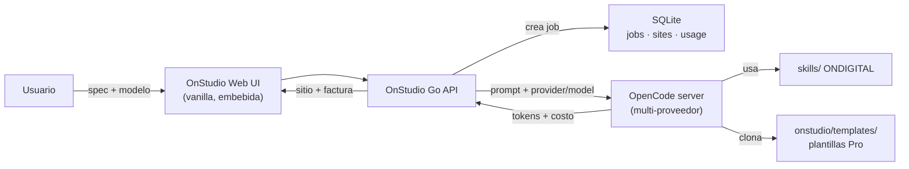

# OnStudio

**OnStudio** es el producto de ONDIGITAL para **generar sitios web de alta
calidad para empresas mediante IA**. El usuario elige un modelo, describe su
negocio/aplicación, y OnStudio usa los *skills* existentes de ONDIGITAL y un
catálogo de **plantillas Pro** (apps base escritas a mano por el equipo) para
clonar, renombrar y entregar un sitio completo y listo para marca.

El cobro se calcula **por la cantidad de tokens** que consumió la generación.

> **Estado: preparación del terreno (Phase 0).** Esta carpeta contiene
> documentación, contratos de configuración y andamiaje. La aplicación todavía
> **no** está implementada. El plan vivo de construcción está en
> [`PLAN.md`](PLAN.md); la continuidad entre sesiones/modelos en
> [`last_session.md`](last_session.md).

## Idea en una frase

> Spec del negocio + modelo elegido → OnStudio toma una plantilla Pro, la
> rebrandea con los skills de ONDIGITAL, emite el sitio y factura por tokens.

## Decisiones fijadas

| Tema | Decisión |
| --- | --- |
| Nombre | OnStudio (`onstudio/`, docs en `docs/onstudio/`) |
| Motor de IA | **OpenCode server API** (opencode.ai), usado **multi-proveedor** |
| Selección de modelo | El usuario elige el modelo por trabajo |
| Stack | Go (un binario) + UI web vanilla embebida (`//go:embed`) + SQLite |
| Facturación | Por tokens: costo base del proveedor × margen configurable |
| Plantillas | Apps "Pro" de ONDIGITAL clonadas y rebrandeadas por la IA |
| API key | **Placeholder** que el usuario completa por `.env`/entorno |

## Cómo encajan las piezas



## Mapa de esta documentación

| Documento | Qué cubre |
| --- | --- |
| [`architecture.md`](architecture.md) | Topología Go + embed + SQLite + OpenCode, modelo de datos, procesos |
| [`generation-pipeline.md`](generation-pipeline.md) | De la spec al sitio: intake → plantilla → rebrand → emisión → cobro |
| [`opencode-integration.md`](opencode-integration.md) | Servidor OpenCode, endpoints, config, selección de modelo, auth, captura de uso |
| [`token-billing.md`](token-billing.md) | Captura de tokens, costo base, margen, configuración de precios |
| [`template-catalog.md`](template-catalog.md) | Plantillas Pro mapeadas a los productos existentes |
| [`api-and-config.md`](api-and-config.md) | API HTTP de OnStudio + contrato de archivos de configuración |
| [`roadmap.md`](roadmap.md) | Entrega por fases después de la preparación del terreno |
| [`PLAN.md`](PLAN.md) | **Efímero.** Plan vivo de construcción (se borra al terminar) |
| [`last_session.md`](last_session.md) | **Efímero.** Traspaso entre sesiones/modelos |

## Alcance y límites (versión actual)

- **No** hay código de aplicación todavía: nada de `main.go`, JS de la app, ni
  clones HTML de plantillas. Eso es Phase 1+ en [`roadmap.md`](roadmap.md).
- La **API key es un placeholder**. Nunca se commitea una llave real. Ver
  `onstudio/.env.example` y el `.gitignore` raíz.
- Como el resto de productos locales de ONDIGITAL, OnStudio nace **sin** auth de
  producción ni almacenamiento durable garantizado: se define en su fase.
- Copys de producto en español; convenciones es-HN/HNL cuando apliquen.

## Ejecución prevista (cuando exista la app)

```bash
cd onstudio
cp .env.example .env          # el usuario completa su API key aquí
cp opencode.example.json opencode.json
cp config.example.json config.json
make dev                      # servirá en http://localhost:8100 (previsto)
```
