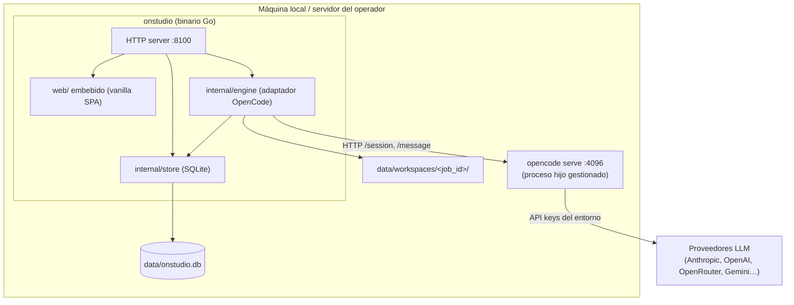

# OnStudio — Arquitectura

> Documento de diseño para la **preparación del terreno**. Define la topología y
> el modelo de datos previstos. No hay código todavía; los nombres de tipos,
> rutas y campos son la referencia que la implementación (Phase 1+) debe seguir.

## Principios

- **Un solo binario Go**, sin CGO, sin Node, sin build step. UI embebida con
  `//go:embed web`. SQLite vía `modernc.org/sqlite`. Igual que OnStock y OnServe.
- **La llave de API nunca toca el navegador.** La UI habla solo con la API Go;
  la API Go es la única que conoce las credenciales del proveedor (vía entorno).
- **OpenCode es el motor**, no una dependencia de UI. OnStudio orquesta sesiones
  de OpenCode y traduce su salida a *jobs*, *sites* y *facturas*.
- **Multi-tenant por negocio/job**: cada generación vive en su propio espacio de
  trabajo y su propio registro de uso. Aislamiento por `job_id`.

## Topología de procesos



### ¿OpenCode como hijo o externo?

Dos modos soportados por diseño (configurable en `config.json`):

1. **Managed child (default):** OnStudio lanza `opencode serve` como subproceso,
   en `127.0.0.1`, con auth básica generada, y lo apaga al cerrar. Cero fricción.
2. **External:** OnStudio se conecta a un `opencode serve` ya corriendo (otra
   máquina/contenedor). Útil para escalar o aislar el motor del front.

En ambos casos la UI **solo** habla con la API Go; nunca con OpenCode directo.

## Capas internas (previstas)

```
onstudio/
  main.go                      # HTTP + //go:embed web + arranque del engine
  Makefile                     # dev / test / build (estilo onserve)
  internal/
    store/                     # SQLite + reglas de negocio
      store.go                 #   apertura DB, migraciones, helpers
      jobs.go                  #   ciclo de vida de un job de generación
      sites.go                 #   sitios generados y su workspace
      usage.go                 #   tokens, costo base, precio, factura
      pricing.go               #   tabla de precios/margen por modelo
      models.go                #   catálogo de modelos permitidos
    engine/                    # adaptador OpenCode
      opencode.go              #   start/connect, sesión, prompt, eventos
      usage.go                 #   parseo de tokens/costo del mensaje assistant
      prompt.go                #   construcción del prompt de generación
    pipeline/                  # orquestación spec → sitio
      intake.go                #   validación/normalización de la spec
      template.go              #   selección de plantilla Pro
      rebrand.go               #   transform de marca (nombres, colores, copy)
      emit.go                  #   escritura del sitio + zip/preview
    httpapi/                   # handlers REST + export/preview/download
      router.go
      jobs.go
      catalog.go
      billing.go
  web/                         # SPA vanilla embebida (index.html, css, js)
  templates/                   # plantillas Pro fuente (Phase 6)
  data/                        # SQLite + workspaces (git-ignored)
```

> Esta estructura es **orientativa**. La implementación puede ajustar nombres,
> pero debe preservar: separación store/engine/pipeline/httpapi, llaves solo en
> el server, y un workspace por job.

## Modelo de datos (SQLite, previsto)

```sql
-- Un trabajo de generación = una "compra" facturable por tokens.
CREATE TABLE jobs (
  id            TEXT PRIMARY KEY,        -- uuid
  created_at    TEXT NOT NULL,           -- ISO-8601
  status        TEXT NOT NULL,           -- queued|running|done|error|canceled
  provider      TEXT NOT NULL,           -- ej. anthropic
  model         TEXT NOT NULL,           -- ej. claude-sonnet-4-5
  template_id   TEXT,                    -- plantilla Pro elegida
  spec_json     TEXT NOT NULL,           -- spec del negocio (normalizada)
  opencode_session TEXT,                 -- id de sesión OpenCode
  error_msg     TEXT
);

-- Sitio resultante de un job.
CREATE TABLE sites (
  id            TEXT PRIMARY KEY,
  job_id        TEXT NOT NULL REFERENCES jobs(id),
  business_name TEXT NOT NULL,
  workspace_dir TEXT NOT NULL,           -- data/workspaces/<job_id>/
  preview_url   TEXT,
  created_at    TEXT NOT NULL
);

-- Uso de tokens y costo por job (base de la factura).
CREATE TABLE usage (
  id            TEXT PRIMARY KEY,
  job_id        TEXT NOT NULL REFERENCES jobs(id),
  input_tokens  INTEGER NOT NULL DEFAULT 0,
  output_tokens INTEGER NOT NULL DEFAULT 0,
  cache_read_tokens  INTEGER NOT NULL DEFAULT 0,
  cache_write_tokens INTEGER NOT NULL DEFAULT 0,
  provider_cost NUMERIC NOT NULL DEFAULT 0,  -- costo del proveedor (USD)
  price        NUMERIC NOT NULL DEFAULT 0,   -- cobro al cliente (costo×margen)
  currency     TEXT NOT NULL DEFAULT 'USD',  -- conversión a HNL en presentación
  captured_at  TEXT NOT NULL
);

-- Precio/margen por modelo (semilla desde config.json; ver token-billing.md).
CREATE TABLE pricing (
  provider     TEXT NOT NULL,
  model        TEXT NOT NULL,
  input_per_mtok  NUMERIC,              -- costo base USD / 1M tokens
  output_per_mtok NUMERIC,
  margin       NUMERIC NOT NULL DEFAULT 1.0, -- multiplicador de cobro
  PRIMARY KEY (provider, model)
);
```

Ver [`token-billing.md`](token-billing.md) para cómo se llenan `provider_cost` y
`price`, y [`generation-pipeline.md`](generation-pipeline.md) para el ciclo del job.

## Aislamiento y seguridad

- **Llaves:** solo en entorno del proceso Go / OpenCode. Nunca en `web/`, nunca
  en respuestas de la API, nunca en SQLite, nunca en commits.
- **Workspaces:** cada job escribe únicamente bajo `data/workspaces/<job_id>/`.
  La emisión valida que ninguna ruta escape ese directorio (path traversal).
- **Datos efímeros vs durables:** `data/` es git-ignored. Respaldos y retención
  se definen en su fase; no asumir durabilidad de producción todavía.
- **Auth de operador:** la versión inicial es app local controlada por el negocio
  (como OnServe). Auth/roles multiusuario es trabajo de fase posterior.

## Verificación (cuando exista código)

- `cd onstudio && make test` → `go vet ./... && go test ./... && go build ./...`.
- Smoke test de la UI con la app corriendo en `:8100`, desktop y móvil.
- Revisión read-only de billing, manejo de llaves y aislamiento por job antes de
  exponerlo (`/codex:adversarial-review`).
