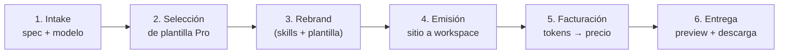

# OnStudio — Pipeline de Generación

> Cómo OnStudio convierte una *spec* de negocio en un sitio entregable y
> facturable. Diseño para Phase 1+; aquí se fija el contrato del flujo.

## Vista general



Cada etapa actualiza el `job` en SQLite (`queued → running → done|error`).

## 1. Intake de la spec

Entrada del usuario en la UI; normalizada a un JSON estable. Campos previstos
(ver el skill `references/spec-intake.md` para la versión canónica):

```jsonc
{
  "business_name": "Panadería La Espiga",
  "industry": "alimentos/retail",          // mapea a categoría de plantilla
  "site_type": "landing",                   // landing | catalog | saas | booking | ...
  "locale": "es-HN",
  "currency": "HNL",
  "brand": {
    "use_company_colors": false,            // false = tema claro por defecto
    "primary": null, "accent": null,        // opcional; si null usa tokens del skill
    "logo_hint": "espiga de trigo"
  },
  "pages": ["inicio", "productos", "nosotros", "contacto"],
  "contact": { "phone": "+504...", "rtn": null, "address": "..." },
  "content_notes": "Pan artesanal, pedidos por WhatsApp, horario...",
  "model": { "provider": "anthropic", "model": "claude-sonnet-4-5" }
}
```

Reglas de intake:

- **Validar** que `model` esté en la lista de modelos permitidos (`config.json`).
- **Default de marca = tema claro** (blanco); `use_company_colors` activa el tema
  navy de ONDIGITAL. Esto respeta la convención de theming del repo.
- Copys en **español**; convenciones es-HN/HNL/RTN/+504 cuando el rubro lo pida.
- Sanitizar texto libre antes de inyectarlo al prompt (evitar inyección/abuso).

## 2. Selección de plantilla Pro

`industry` + `site_type` → una plantilla del catálogo
([`template-catalog.md`](template-catalog.md), manifest en
`onstudio/templates/MANIFEST.md`). Si no hay match exacto, se elige la plantilla
genérica más cercana y se anota la decisión en el job.

La plantilla aporta: estructura de archivos, layout, componentes y calidad de
código. El skill aporta: tokens de diseño, dictado de UI en español, patrones de
auth/datos y reglas de marca.

## 3. Rebrand (el corazón de OnStudio)

Aquí entra OpenCode con el modelo elegido. El prompt de generación combina:

1. **Instrucciones base** cargadas vía `opencode.json` → `instructions`
   (AGENTS.md + skills + reglas de rebrand). Ver
   [`opencode-integration.md`](opencode-integration.md).
2. **La plantilla Pro** como código fuente a transformar.
3. **La spec** del negocio como objetivo del rebrand.

El modelo transforma la plantilla siguiendo `references/rebrand-rules.md`:

- Renombrar negocio/marca/dominios/copys al nuevo negocio.
- Aplicar tema (claro por defecto o company-colors), colores y logo/robot.
- Ajustar páginas/secciones a `pages` y `content_notes`.
- **Preservar** calidad y patrones del template (no degradar el código Pro).
- **No inventar** datos sensibles (RTN, precios legales, claims) — usar lo provisto
  o dejar placeholders claros.

## 4. Emisión

El sitio resultante se escribe **solo** bajo `data/workspaces/<job_id>/`.
La etapa de emisión:

- Valida rutas (sin path traversal fuera del workspace).
- Genera un `preview_url` local servido por la API Go.
- Empaqueta un `.zip` descargable.

## 5. Facturación por tokens

Al cerrar la sesión de OpenCode, OnStudio lee el uso (input/output/cache tokens y
costo) del mensaje del asistente y calcula el cobro:

```
provider_cost = costo reportado por el modelo (o tokens × tarifa del registro)
price         = provider_cost × margin(modelo)
```

Persistido en `usage`. Presentación en HNL además de USD. Detalle completo en
[`token-billing.md`](token-billing.md).

## 6. Entrega

La UI muestra: preview embebido, descarga `.zip`, desglose de tokens y la factura
(USD + HNL). El job queda en `done` con su `site` y su `usage`.

## Estados y errores

| Estado | Significado |
| --- | --- |
| `queued` | Job creado, aún sin sesión OpenCode |
| `running` | Sesión activa generando |
| `done` | Sitio emitido + uso facturado |
| `error` | Falla del proveedor/emisión; `error_msg` poblado |
| `canceled` | Cancelado por el usuario antes de terminar |

Reglas de robustez:

- **Cobro solo si hubo consumo medible**; si la sesión falla sin tokens, no se
  factura. Si falla con tokens parciales, se factura lo consumido y se marca
  `error` con nota (política a confirmar con el usuario en Phase 4).
- **Idempotencia:** reintentar un job no duplica `usage`; cada captura se ata al
  `opencode_session` + turno.
- **Timeouts:** alinear con `timeout` de OpenCode (default 300000 ms) y marcar
  `error` si se excede.

## Verificación del pipeline (Phase 3+)

- Pruebas de `intake` (validación de modelo/locale/marca).
- Pruebas de `template` (mapeo industria→plantilla, fallback genérico).
- Pruebas de `emit` (aislamiento de workspace, no path traversal).
- Prueba end-to-end con un modelo barato y una spec mínima.
