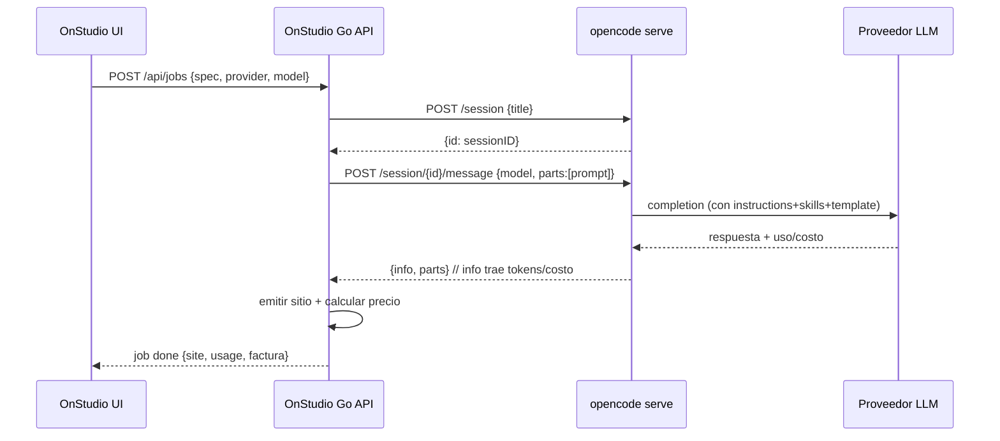

# OnStudio — Integración con OpenCode

> Cómo OnStudio usa **OpenCode** (opencode.ai) como motor de generación
> multi-proveedor. Referencia de diseño para Phase 2. **Antes de implementar,
> verificar nombres exactos de endpoints/campos contra el OpenAPI en `/doc`**,
> porque la API puede cambiar entre versiones.

## Por qué OpenCode

- **Multi-proveedor** (Anthropic, OpenAI, OpenRouter, Gemini y muchos más) con un
  solo contrato. El usuario elige el modelo por trabajo.
- **Headless server** (`opencode serve`) con OpenAPI, ideal para que un binario Go
  lo controle por HTTP.
- **`instructions` + skills**: OpenCode puede cargar `AGENTS.md` y los skills de
  ONDIGITAL como contexto base de cada generación.
- **Sustitución `{env:VAR}`**: las llaves se inyectan por entorno, nunca se
  hardcodean.

## Servidor

```bash
opencode serve --port 4096 --hostname 127.0.0.1
```

- Por defecto local (`127.0.0.1`). OnStudio lo lanza como **proceso hijo
  gestionado** (default) o se conecta a uno externo (ver `architecture.md`).
- **Auth básica opcional** vía entorno: `OPENCODE_SERVER_USERNAME` /
  `OPENCODE_SERVER_PASSWORD`. OnStudio genera credenciales para el hijo y las usa
  en cada request.
- **OpenAPI** servido en `/doc`. Tratarlo como la fuente de verdad del contrato.
- Si alguna vez un navegador llamara directo (no es el diseño), haría falta
  `--cors <origin>`. En OnStudio el navegador **no** llama a OpenCode: llama a la
  API Go, que actúa de proxy.

## Flujo de una generación



### Endpoints usados (verificar en `/doc`)

| Acción | Método/Ruta | Cuerpo (resumen) | Respuesta |
| --- | --- | --- | --- |
| Crear sesión | `POST /session` | `{ title?, parentID? }` | `Session` (incluye `id`) |
| Prompt (sync) | `POST /session/:id/message` | `{ model, agent?, parts:[{type:"text",text}] }` | `{ info, parts }` |
| Prompt (async) | `POST /session/:id/prompt_async` | igual | `204` + eventos |
| Eventos (SSE) | `GET /event` | — | stream de eventos |

- **Selección de modelo:** el cuerpo del prompt lleva el modelo elegido, como
  `{ providerID, modelID }` (p.ej. `anthropic` / `claude-sonnet-4-5`) o el string
  `provider/model` según versión. OnStudio lo arma desde `spec.model`.
- **Streaming:** para progreso en vivo en la UI, OnStudio puede usar el endpoint
  async + SSE y reenviar el progreso al navegador por su propio canal. La v1
  puede empezar con el endpoint síncrono y subir a streaming después.

### Captura de tokens y costo

Tras el turno, el **mensaje del asistente** trae el uso (input/output tokens,
tokens de cache y, en muchos proveedores, costo). OnStudio lo lee del objeto
`info` de la respuesta y lo persiste en `usage`.

> ⚠️ **Verificar el path exacto** (`tokens.input`/`tokens.output`/`tokens.cache`,
> `cost`, etc.) contra `/doc` de la versión instalada antes de wirear billing.
> Si un proveedor no reporta `cost`, calcularlo con la tarifa del registro de
> precios (`pricing`). Ver [`token-billing.md`](token-billing.md).

## Configuración (`opencode.json`)

OnStudio versiona un **ejemplo** en `onstudio/opencode.example.json`; el archivo
real (`opencode.json`) lo crea el operador y queda git-ignored. Forma prevista:

```jsonc
{
  "$schema": "https://opencode.ai/config.json",
  "model": "anthropic/claude-sonnet-4-5",       // modelo por defecto
  "small_model": "anthropic/claude-haiku-4-5",  // tareas auxiliares baratas
  "provider": {
    "anthropic":  { "options": { "apiKey": "{env:ANTHROPIC_API_KEY}" } },
    "openai":     { "options": { "apiKey": "{env:OPENAI_API_KEY}" } },
    "openrouter": { "options": { "apiKey": "{env:OPENROUTER_API_KEY}" } },
    "google":     { "options": { "apiKey": "{env:GEMINI_API_KEY}" } }
  },
  "instructions": [
    "AGENTS.md",
    "skills/SKILL.md",
    "skills/product/onstudio-generator/SKILL.md",
    "skills/product/onstudio-generator/references/*.md"
  ],
  "agent": {
    "site-builder": {
      "description": "Genera y rebrandea sitios Pro de ONDIGITAL",
      "mode": "all"
    }
  }
}
```

Notas:

- **`{env:VAR}`** se resuelve desde el entorno del proceso → las llaves viven en
  `.env`/entorno, nunca en el JSON commiteado.
- **`instructions`** carga AGENTS.md + el skill de OnStudio + sus referencias como
  contexto base. Así el motor "conoce" las reglas de marca y de rebrand.
- El bloque **`agent`** permite un agente `site-builder` dedicado. Opcional en v1.
- Precedencia: el `opencode.json` en la raíz del proyecto manda sobre el global.

## Autenticación de proveedores

Tres caminos (OnStudio usa el de entorno para no persistir llaves):

1. **Entorno / `.env`** (recomendado): `ANTHROPIC_API_KEY`, `OPENAI_API_KEY`,
   `OPENROUTER_API_KEY`, `GEMINI_API_KEY`, etc. Resueltas por `{env:VAR}`.
2. `opencode auth login` → guarda en `~/.local/share/opencode/auth.json`
   (git-ignored globalmente; **nunca** copiar al repo).
3. Llaves embebidas en config — **prohibido** en OnStudio.

## Modo de fallo y resiliencia

- Si OpenCode no arranca (puerto ocupado, binario ausente): el job queda `error`
  con mensaje claro y la UI sugiere revisar la instalación/puerto.
- Si el proveedor rechaza la llave: `error` sin facturar.
- `timeout` de OpenCode (default 300000 ms) acota turnos colgados; OnStudio marca
  `error` al excederlo.
- Reintentos no duplican `usage` (idempotencia por sesión+turno).

## Checklist de implementación (Phase 2)

1. Resolver binario `opencode` (PATH o ruta en `config.json`); validar versión.
2. Lanzar/conectar servidor; healthcheck contra `/doc`.
3. Crear sesión, enviar prompt con `spec.model`, recibir `{info, parts}`.
4. **Mapear el `info` real** a la tabla `usage` (confirmar campos en `/doc`).
5. Propagar progreso (async+SSE) a la UI.
6. Apagar el hijo limpio al cerrar OnStudio.
